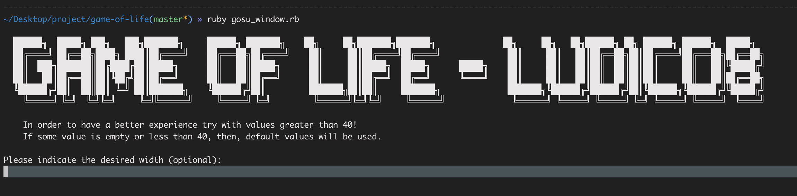
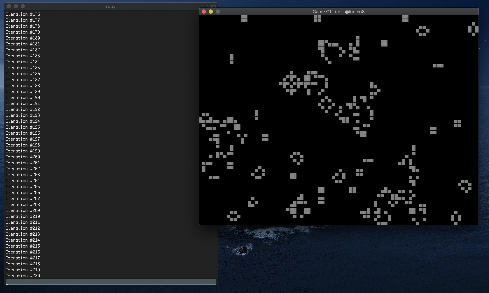
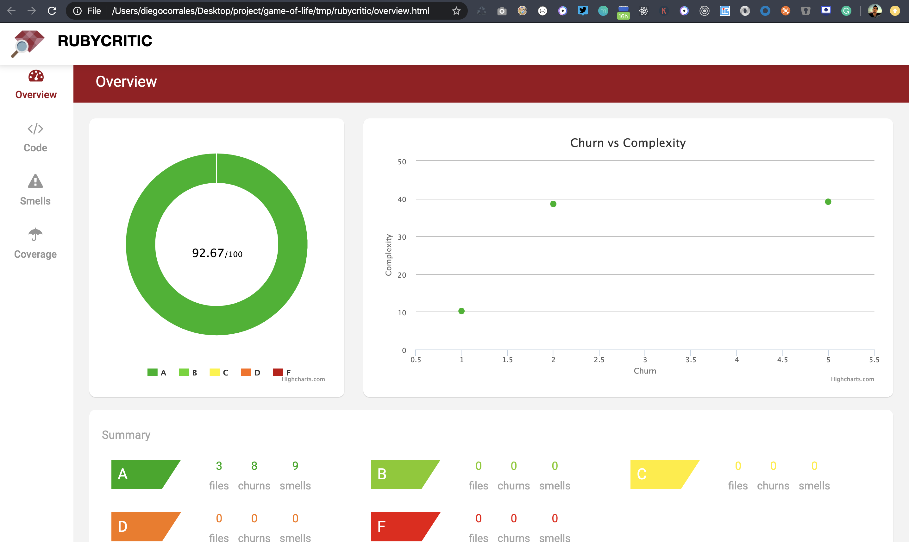

# Conways Game of Life in Ruby programming language
The game is a zero-player game, meaning that its evolution is determined by its initial state, requiring no further input. One interacts with the Game of Life by creating an initial configuration and observing how it evolves. It is Turing complete and can simulate a universal constructor or any other Turing machine.

## Game Rules:
The universe of the Game of Life is an infinite, two-dimensional orthogonal grid of square cells, each of which is in one of two possible states, alive or dead. Every cell interacts with its eight neighbours, which are the cells that are horizontally, vertically, or diagonally adjacent. At each step in time, the following transitions occur:

1. Any live cell with fewer than two live neighbours dies, as if by underpopulation.
2. Any live cell with two or three live neighbours lives on to the next generation.
3. Any live cell with more than three live neighbours dies, as if by overpopulation.
4. Any dead cell with exactly three live neighbours becomes a live cell, as if by reproduction.

These rules, which compare the behavior of the automaton to real life, can be condensed into the following:

1. Any live cell with two or three live neighbors survives.
2. Any dead cell with three live neighbors becomes a live cell.
3. All other live cells die in the next generation. Similarly, all other dead cells stay dead.

## Setup:
1. Clone this repo
2. Install libgosu in your env, for mac you can do this with bre `brew install libgosu`, for linux check this link https://www.libgosu.org/cpp.html
3. From the root path of the project run `bundle install`
4. Finally run `ruby gosu_window.rb`

## Game Running

## Rubycritic (92.67)
1. Install rubycritig gem https://github.com/whitesmith/rubycritic
2. From the root path of the project run `rubycritic` to check all files, or `rubycritic file_name` to check a single one.

Reference: https://en.wikipedia.org/wiki/Conway%27s_Game_of_Life
